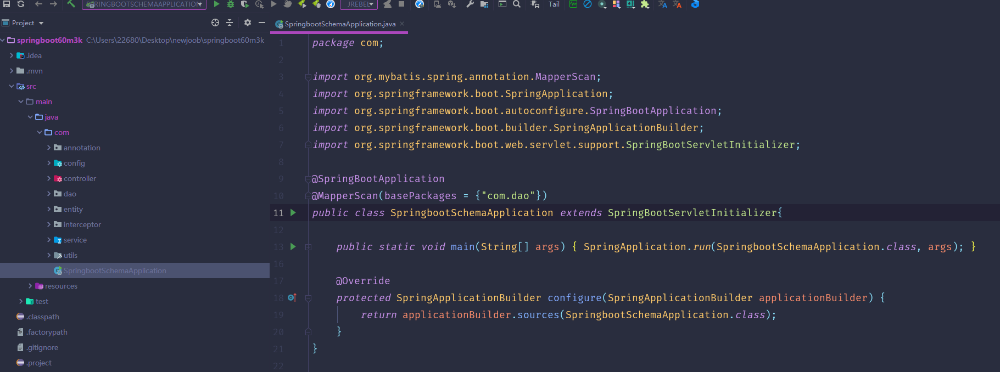
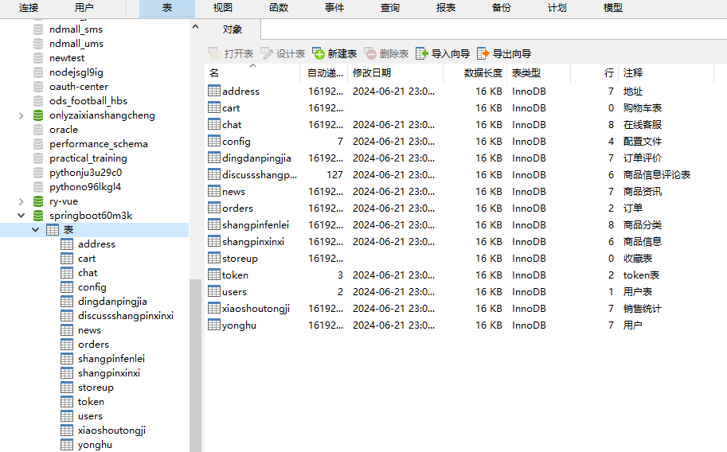
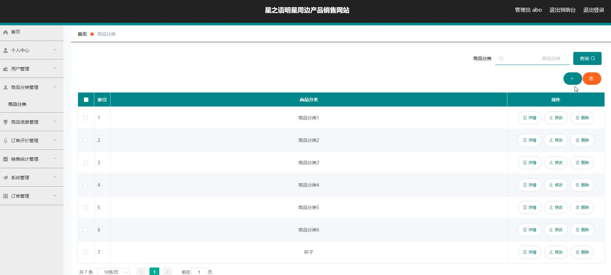
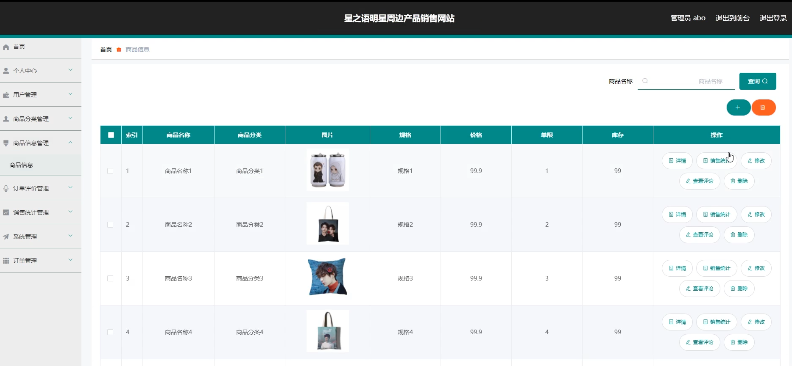
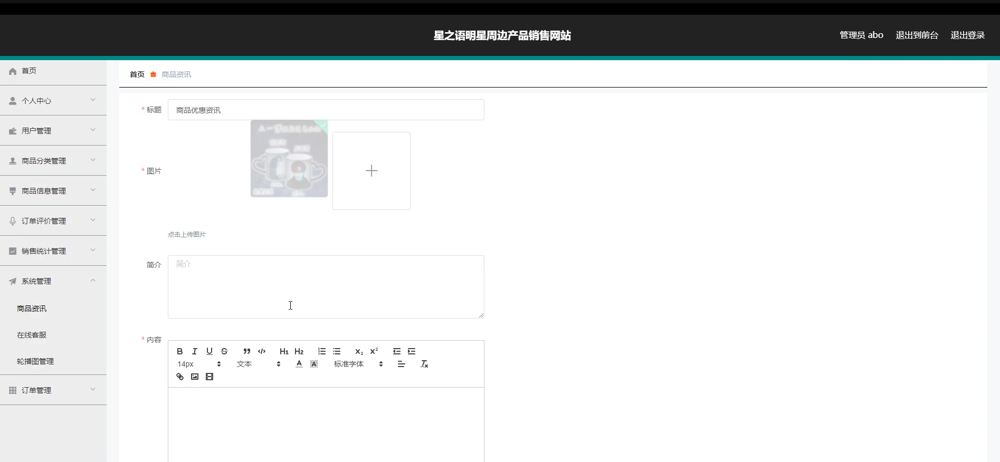
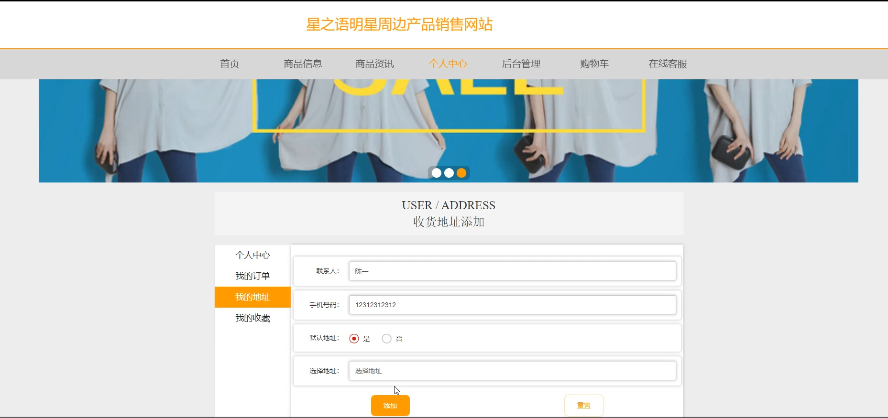
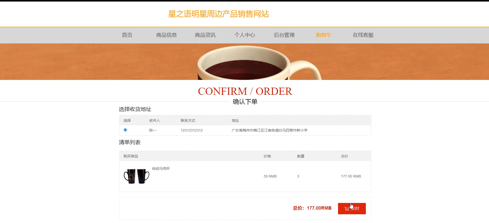
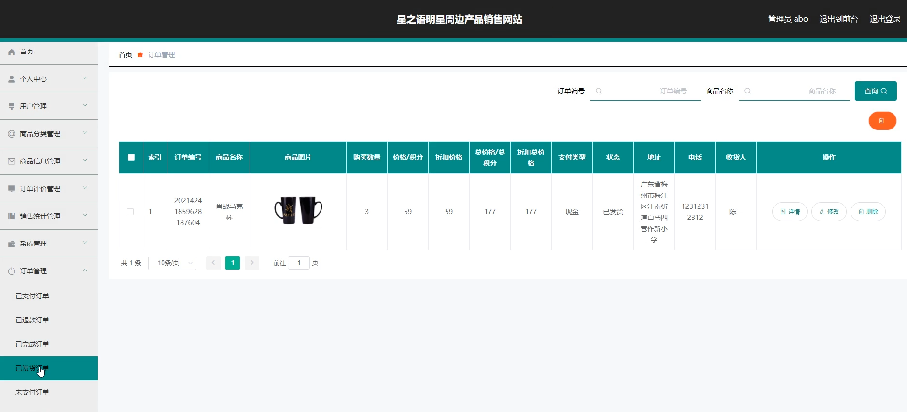
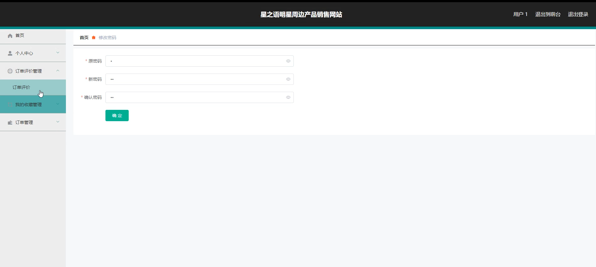

# 基于springboot的星之语明星周边产品销售网站

#### 介绍

星之语明星周边产品销售网站是一个基于Spring Boot框架构建的在线购物平台，专注于为粉丝提供各类明星的周边产品。该系统集商品展示、购买、支付、评价等功能于一体，为管理员和用户提供了丰富的操作界面和便捷的功能模块。系统分为管理员角色和用户角色，每种角色拥有不同的权限和功能，以满足不同用户的需求。

#### 技术栈

后端技术栈：Springboot+Mysql+Maven

前端技术栈：Vue+Html+Css+Javascript+ElementUI

开发工具：Idea+Vscode+Navicate

#### 系统功能介绍

管理员角色功能模块

个人中心：管理员可在此模块查看和修改自己的个人信息，如账号、密码、联系方式等。  
用户管理：管理员可以对网站注册用户进行管理，包括查看用户信息、编辑用户信息、禁用或启用用户账号等。  
商品分类管理：此模块允许管理员添加、编辑、删除商品分类，以及调整分类的层级关系。  
商品信息管理：管理员可以在此模块上传、编辑、下架商品信息，包括商品名称、价格、描述、图片等。  
订单评价管理：管理员可以查看用户对订单的评价，并对评价进行回复或管理。  
销售统计管理：提供销售数据的统计和分析功能，如销售额、销量、热销商品等。  
系统管理：包括系统参数设置、权限管理、日志查看等功能，确保系统的稳定运行和数据安全。  
订单管理：管理员可以查看、处理用户的订单，如确认订单、发货、退款等。  

用户角色功能模块

商品信息：用户可以浏览各类明星周边产品，查看商品详情、价格、库存等信息。  
商品资讯：提供与明星相关的新闻、活动、资讯等内容，增强用户粘性。  
个人中心：用户可以查看和修改自己的个人信息，如收货地址、联系方式等。  
后台管理：  
订单评价管理：用户可以对已购买的商品进行评价，并查看自己的评价记录。  
我的收藏管理：用户可以收藏自己感兴趣的商品，方便后续查找和购买。  
订单管理：用户可以查看自己的订单状态，如待付款、待发货、已发货、已完成等，并进行相应的操作。  
购物车：用户可以将商品加入购物车，进行批量购买和结算。  
在线客服：提供在线客服功能，用户可以随时咨询商品信息、订单状态等问题，获得及时解答。  

#### 系统作用

1. 对用户的作用

提供丰富的明星周边产品选择，满足粉丝的购物需求。  
提供便捷的购物流程和安全的支付环境，确保用户购物体验。  
提供商品评价和资讯服务，帮助用户做出更明智的购物决策。  
提供在线客服支持，解决用户购物过程中的疑问和问题。  

2. 对管理员的作用

实现对商品、用户、订单等信息的全面管理，确保网站正常运营。  
通过销售统计功能，了解销售情况，为商品采购和营销策略提供依据。  
管理系统权限和用户信息，确保系统数据的安全性。  
提供在线客服支持，解决用户问题和纠纷，维护网站良好口碑。  

#### 系统功能截图

代码结构

数据库表

登录

商品分类

商品信息管理

系统管理

个人中心

购物车

订单管理

用户端后台管理

#### 总结

星之语明星周边产品销售网站是一个功能全面、操作便捷、用户友好的在线购物平台。通过该系统，管理员可以实现对商品、用户、订单等信息的全面管理，确保网站的正常运营和安全性；用户则可以轻松浏览和购买明星周边产品，享受便捷的购物流程和优质的客户服务。该系统不仅满足了用户的购物需求，也为管理员提供了强大的管理工具和数据支持，是明星周边产品销售领域的优秀解决方案。

#### 使用说明

创建数据库，执行数据库脚本 修改jdbc数据库连接参数 下载安装maven依赖jar 启动idea中的springboot项目

后台管理：http://localhost:8080/feiwuzhiwenhua/admin/dist/index.html#/login

前台页面：http://localhost:8080/feiwuzhiwenhua/front/pages/login/login.html

管理员 admin 密码：admin
